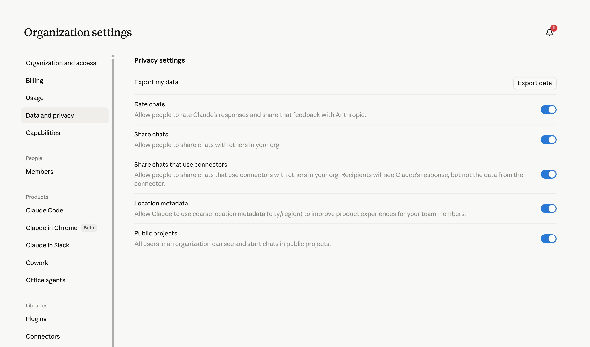
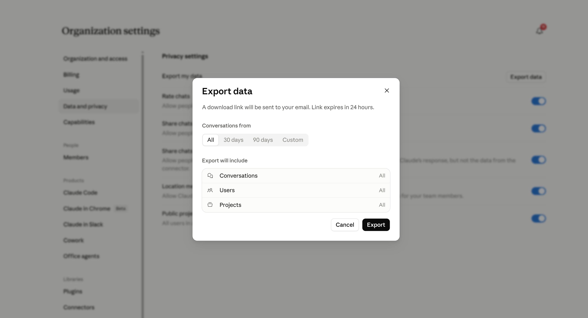

<div align="center">

# 📊 Claude Teams Analytics

**A local, privacy-first analytics dashboard for your Claude Teams export data.**

Turn raw Claude Teams exports into a fast, beautiful, and fully interactive dashboard — running entirely on your machine. No data leaves your system.

[](./LICENSE)
[](https://nodejs.org)
[](https://react.dev)
[](https://vitejs.dev)
[](https://github.com/Dipen-Dedania/cluade-teams-analytics/pulls)
[](https://github.com/Dipen-Dedania/cluade-teams-analytics/stargazers)

</div>

---

## ✨ Why This Exists

Claude's built-in usage tab shows you billing and seat counts. This project shows you **everything else**:

- Which users are most active — and which have gone quiet
- What topics your team is working on
- When your team works (hourly heatmaps, weekday patterns)
- Which files get uploaded most often
- Full conversation history with message-level detail
- Tool-use and thinking-block counts per conversation

All powered by your own export. No cloud. No API keys. No data sent anywhere.

## Demo


## 📸 How to Export Your Claude Teams Data

**Step 1 — Go to Organisation Settings → Data and Privacy**



**Step 2 — Click "Export data" and choose your date range**



You'll receive a download link by email within a few minutes. Extract the ZIP into the `data/` folder and you're ready to go.

---

## 🚀 Quick Start

```bash
# 1. Clone the repo
git clone https://github.com/Dipen-Dedania/cluade-teams-analytics.git
cd cluade-teams-analytics

# 2. Install dependencies
npm install

# 3. Place your Claude Teams export files in data/
#    (see Data Requirements below)

# 4. Generate the analytics
npm run analyze

# 5. Start the dashboard
npm run dev
```

Open [http://localhost:3033](http://localhost:3033) — that's it. ✅

> **Don't have a real export yet?** The repo ships with sample data in `sample/`. Copy it to `data/` to explore the dashboard instantly.
>
> **macOS / Linux:**
>
> ```bash
> cp -r sample/* data/
> npm run analyze && npm run dev
> ```
>
> **Windows (PowerShell):**
>
> ```powershell
> Copy-Item -Recurse sample\* data\
> npm run analyze; npm run dev
> ```

---

## 📋 What the Dashboard Shows

| Section                       | Details                                                                                                            |
| ----------------------------- | ------------------------------------------------------------------------------------------------------------------ |
| **Team Overview**             | Total conversations, messages, active vs. inactive users, files uploaded, tool calls                               |
| **Conversation Activity**     | Daily / monthly chart with conversation volume over time                                                           |
| **Hourly & Weekday Heatmaps** | When is your team most productive?                                                                                 |
| **Topic Breakdown**           | Auto-classified into Backend, Frontend, Design, DevOps, Data & BI, Mobile, Writing, Code Review, Product, Learning |
| **User Drilldowns**           | Per-user stats: message counts, prompt length, active days, topics, first/last activity                            |
| **Conversation Viewer**       | Browse every message in a conversation, including attachments and tool results                                     |
| **File Analytics**            | Most uploaded file types and file names across all conversations                                                   |
| **Project Summaries**         | All Claude Projects with doc counts, prompt templates, and creator info                                            |
| **Design Chats**              | Claude design chat history with attachment counts                                                                  |
| **Memories**                  | All saved memories in one place                                                                                    |

---

## 📁 Data Requirements

Place your extracted Claude Teams export in the `data/` folder:

```
data/
├── conversations.json      ← required
├── users.json              ← required
├── memories.json           ← optional
├── projects/
│   └── *.json              ← optional
└── design_chats/
    └── *.json              ← optional
```

The dashboard degrades gracefully if optional files are missing. `conversations.json` and `users.json` are the primary sources.

---

## 🏗 Project Structure

```
claude-teams-analytics/
├── data/                   ← your Claude Teams export goes here (gitignored)
├── sample/                 ← demo data for trying the app without a real export
├── scripts/
│   ├── analyze.mjs         ← reads data/, writes public/generated/
│   └── serve.mjs           ← production static server
├── src/
│   ├── main.jsx            ← React app entry point
│   └── styles.css          ← all styles
├── public/
│   └── generated/          ← output of analyze.mjs (gitignored)
│       ├── analytics.json
│       └── conversations/
│           └── {uuid}.json
└── dist/                   ← production build output (gitignored)
```

---

## ⚙️ All Commands

| Command           | Description                                           |
| ----------------- | ----------------------------------------------------- |
| `npm install`     | Install dependencies                                  |
| `npm run analyze` | Process `data/` and generate `public/generated/`      |
| `npm run dev`     | Start Vite dev server on port 3033                    |
| `npm run build`   | Analyze + build production bundle                     |
| `npm run serve`   | Serve the production build at `http://127.0.0.1:4173` |

```bash
# Run dev on a custom port
npm run dev -- --port 5000
```

---

## 🔬 How It Works

```
Claude Teams Export (ZIP)
  └─▶ data/
        └─▶ scripts/analyze.mjs   (streaming JSON parser — memory efficient)
              └─▶ public/generated/analytics.json         (summary + index)
              └─▶ public/generated/conversations/{uuid}.json  (one per conversation)
                    └─▶ React Dashboard (Vite + React 19)
```

The analyzer **streams** `conversations.json` one object at a time using a custom character-level JSON parser. This means it handles exports with tens of thousands of conversations without running out of memory.

The generated data is intentionally split:

- **`analytics.json`** — compact index loaded on startup
- **`conversations/{uuid}.json`** — full message text loaded only when you open a conversation

This keeps the dashboard snappy regardless of export size.

---

## 🔒 Privacy

> **Your data never leaves your machine.**

Claude Teams exports contain sensitive business information — code, customer details, uploaded file names, and user email addresses. This project is designed with that in mind:

- ✅ All processing happens locally via Node.js
- ✅ No external API calls, no telemetry, no tracking
- ✅ `data/` and `public/generated/` are `.gitignore`d by default
- ✅ `dist/` is excluded to prevent accidentally publishing generated data
- ⚠️ Review screenshots before sharing — they may show real names or emails
- ⚠️ Never commit your `data/` folder to a public repository

---

## 🤝 Contributing

Contributions are welcome! Here are some good ways to help:

- 🐛 **Bug reports** — open an issue with steps to reproduce
- 💡 **Feature ideas** — open a discussion or issue
- 🔧 **PRs** — fix bugs, improve the UI, add new metrics

```bash
# Fork and clone, then:
git checkout -b feature/my-improvement
npm install && npm run dev
# Make your changes, then open a PR
```

Please use sample/mock data (not real exports) when submitting screenshots or test cases.

---

## ⚡ Known Limitations

| Limitation                           | Status                                                                                         |
| ------------------------------------ | ---------------------------------------------------------------------------------------------- |
| Single export folder at a time       | Planned: multi-export support ([docs/multiple-exports-plan.md](docs/multiple-exports-plan.md)) |
| Keyword-based topic detection        | Planned: optional semantic clustering                                                          |
| No persistent database               | Planned                                                                                        |
| No authentication or hosted backend  | By design for local-first privacy                                                              |
| Overlapping exports not deduplicated | Planned                                                                                        |

---

## 📄 License

[MIT](./LICENSE) — free to use, modify, and distribute.

---

<div align="center">

If this saved you time, please consider giving it a ⭐ — it helps others find the project!

**[⭐ Star on GitHub](https://github.com/Dipen-Dedania/cluade-teams-analytics)**

</div>
